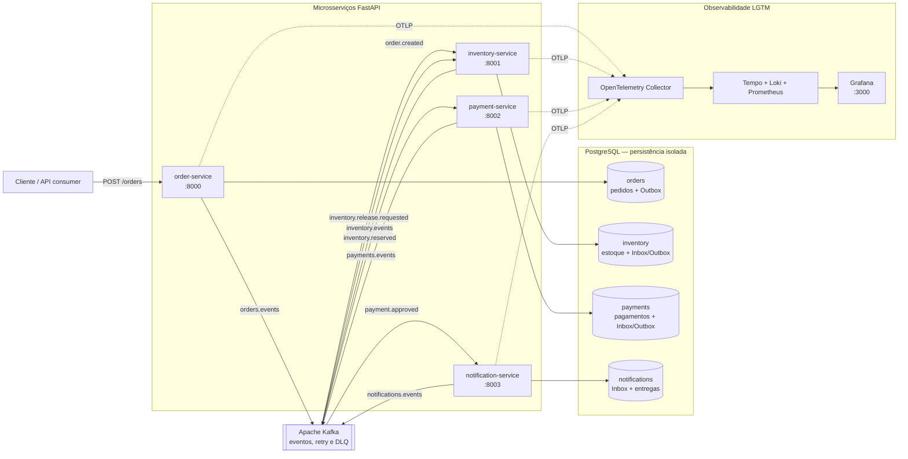
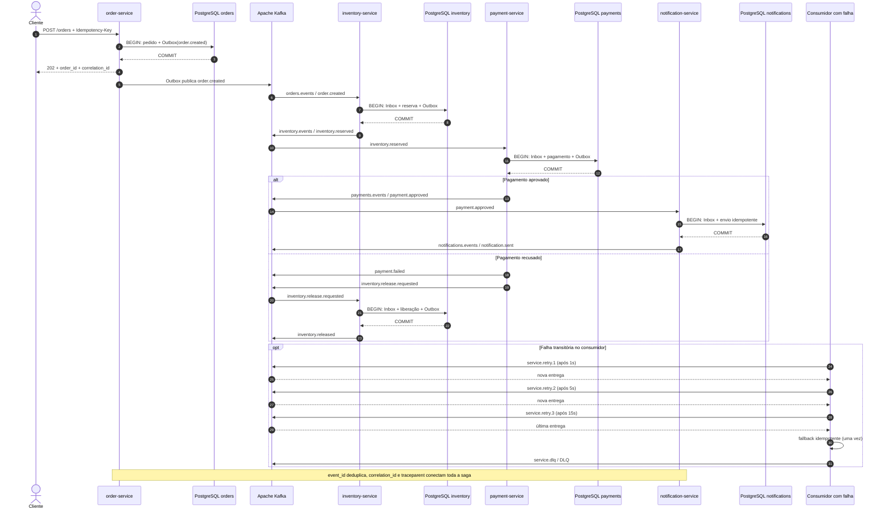

# Bukhara Python — saga distribuída de pedidos

Projeto de estudo de uma saga coreografada com quatro microsserviços Python, comunicação assíncrona e persistência isolada. A aplicação demonstra como combinar **FastAPI**, **Apache Kafka**, **PostgreSQL** e **OpenTelemetry** com idempotência, Inbox/Outbox, retry, fallback, DLQ e compensação.

## O que este projeto demonstra

- Microsserviços independentes para pedidos, estoque, pagamentos e notificações.
- Saga coreografada por eventos, sem um orquestrador central.
- Publicação confiável com Transactional Outbox e consumo idempotente com Inbox.
- Três tentativas de retry, fallback idempotente e Dead Letter Queue por serviço.
- Compensação de estoque quando o pagamento falha.
- Traces, métricas e logs correlacionados na stack local Grafana LGTM.
- Especificações e critérios de aceite verificados mecanicamente.

## Arquitetura HLD

O desenho de alto nível mostra os limites dos sistemas e as integrações principais. Cada microsserviço possui seu próprio banco lógico; Kafka distribui fatos, retries e mensagens de DLQ; todos exportam telemetria via OTLP.



## Arquitetura LLD

O desenho de baixo nível acompanha um pedido e explicita as transações locais. `Inbox` impede que um evento seja processado duas vezes; `Outbox` grava o evento na mesma transação da mudança de domínio e o publica posteriormente.



## Fluxo de eventos

| Evento | Produzido por | Consumido por | Resultado |
|---|---|---|---|
| `order.created` | Pedidos | Estoque | Reserva os itens do pedido. |
| `inventory.reserved` | Estoque | Pagamentos | Autoriza o processamento financeiro. |
| `inventory.rejected` | Estoque | — | Encerra o fluxo sem cobrança. |
| `payment.approved` | Pagamentos | Notificações | Confirma o pedido ao cliente. |
| `payment.failed` | Pagamentos | — | Registra a falha definitiva. |
| `inventory.release.requested` | Pagamentos | Estoque | Inicia a compensação da reserva. |
| `inventory.released` | Estoque | — | Confirma a compensação. |
| `notification.sent` | Notificações | — | Registra a entrega da notificação. |

Todos os envelopes carregam `event_id`, `event_type`, `event_version`, `producer`, `order_id`, `correlation_id`, `causation_id` e `payload`. Veja o [contrato operacional de eventos](docs/events.md).

## Garantias de resiliência

| Mecanismo | Garantia |
|---|---|
| `Idempotency-Key` | Repetir a requisição não cria outro pedido nem outro evento. |
| Inbox | Deduplica eventos recebidos por `event_id`. |
| Transactional Outbox | Persiste estado e evento atomicamente antes da publicação. |
| Retry | Reagenda falhas transitórias em `retry.1`, `retry.2` e `retry.3`, após 1s, 5s e 15s. |
| Fallback | Executa uma ação segura e idempotente depois da última tentativa. |
| DLQ | Isola mensagens inválidas ou definitivamente malsucedidas para investigação. |
| Readiness | `/ready` exige Kafka e PostgreSQL; `/health` verifica apenas o processo. |

O processamento é **efetivamente uma vez**, não uma transação global exatamente uma vez. Detalhes estão no [guia de operação e resiliência](docs/resilience.md).

## Executar localmente

Pré-requisitos:

- Docker Desktop ou Docker Engine com Compose.
- Python 3.11+ para executar os testes fora dos containers.

Suba o ambiente:

```bash
git clone git@github.com:brdoliveira/bukhara-python.git
cd bukhara-python
docker compose up -d --build
docker compose ps
```

Crie um pedido:

```bash
curl -X POST http://localhost:8000/orders \
  -H "Content-Type: application/json" \
  -H "Idempotency-Key: readme-demo-1" \
  -d '{"items":[{"product_id":"book","quantity":1,"price":"10.00"}]}'
```

### Endpoints locais

| Componente | Endereço |
|---|---|
| Pedidos | <http://localhost:8000> |
| Estoque | <http://localhost:8001> |
| Pagamentos | <http://localhost:8002> |
| Notificações | <http://localhost:8003> |
| Kafka | `localhost:9092` |
| PostgreSQL | `localhost:5432` |
| Grafana | <http://localhost:3000> (`admin` / `admin`) |
| OTLP gRPC / HTTP | `localhost:14317` / `localhost:14318` |

Encerre os containers sem apagar os volumes:

```bash
docker compose down
```

## Observabilidade

Os quatro serviços propagam contexto W3C entre HTTP e Kafka. Logs estruturados, métricas e traces incluem atributos pesquisáveis como `service.name`, `order_id`, `event_type`, `correlation_id`, `trace_id` e `span_id`.

O dashboard **Order Saga / Saga da encomenda** é provisionado automaticamente no Grafana. Consulte o [runbook de observabilidade](docs/observability.md) para investigar uma operação do pedido ao trace e aos logs.

## Testes e auditoria da especificação

### Resultado atual

A suíte é hermética: usa doubles para Kafka, PostgreSQL, exportadores OTLP e
integrações externas, portanto não exige Docker para ser executada.

| Indicador | Resultado |
|---|---:|
| Testes automatizados | **111 aprovados** |
| Cobertura do código de produção | **85,84%** |
| Gate mínimo de cobertura | **85%** |
| Critérios de aceite auditados | **31/31** |

O gate considera somente os seis diretórios de produção em `packages/` e
`services/`; testes e migrações não entram no cálculo.

### Escopo da suíte

| Área | Comportamentos exercitados |
|---|---|
| `event_bus` | Envelope, validação, Inbox, Outbox, retry, fallback, DLQ e readiness. |
| `observability` | Logs estruturados, traces, métricas, contexto Kafka, OTLP degradado e shutdown. |
| `order_service` | Idempotência HTTP, persistência, publicação e recuperação da Outbox. |
| `inventory_service` | Reserva/compensação, lifecycle, deduplicação, retry e transações PostgreSQL. |
| `payment_service` | Aprovação/recusa, compensação, consumo idempotente, retry e Outbox. |
| `notification_service` | Consumo, persistência, entrega idempotente, retry e recuperação. |
| Integração | Documentação, arquitetura, observabilidade e configuração do gate. |

### Executar os testes

Instale as dependências de desenvolvimento e execute toda a suíte:

```bash
py -3.12 -m pip install -e ".[dev]"
py -3.12 -B -m pytest -q -p no:cacheprovider
```

O segundo comando já mede a cobertura e falha automaticamente abaixo de 85%.
Para executar uma parte específica sem aplicar o gate global:

```bash
py -3.12 -B -m pytest -q -o addopts="" packages/event_bus/tests
py -3.12 -B -m pytest -q -o addopts="" packages/observability/tests
py -3.12 -B -m pytest -q -o addopts="" services/order_service/tests
py -3.12 -B -m pytest -q -o addopts="" services/inventory_service/tests
py -3.12 -B -m pytest -q -o addopts="" services/payment_service/tests
py -3.12 -B -m pytest -q -o addopts="" services/notification_service/tests
py -3.12 -B -m pytest -q -o addopts="" tests/integration
```

### Auditar a especificação

Verifique os critérios de aceite e o alinhamento entre especificação, tarefas e testes:

```bash
node /path/to/onp-spec-driven/scripts/onp-spec.mjs verify fluxo-pedidos
node /path/to/onp-spec-driven/scripts/onp-spec.mjs verify observabilidade
node /path/to/onp-spec-driven/scripts/onp-spec.mjs verify documentacao-arquitetura
node /path/to/onp-spec-driven/scripts/onp-spec.mjs verify qualidade-codigo
node /path/to/onp-spec-driven/scripts/onp-spec.mjs audit --ci
```

## Estrutura do repositório

```text
.
├── services/                 # quatro microsserviços FastAPI
├── packages/
│   ├── event_bus/            # envelope, Inbox/Outbox, retry e saúde
│   └── observability/         # instrumentação OpenTelemetry compartilhada
├── observability/grafana/    # provisioning e dashboard da saga
├── tests/integration/        # provas dos fluxos entre componentes
├── docs/                     # eventos, resiliência e runbooks
├── .spec/                    # especificações, tarefas e evidências
└── docker-compose.yml        # ambiente Kafka + PostgreSQL + LGTM + serviços
```

## Documentação complementar

- [Referência de código](docs/code-reference.md)
- [Contrato operacional de eventos](docs/events.md)
- [Retry, DLQ, saúde e limites do MVP](docs/resilience.md)
- [Runbook de observabilidade](docs/observability.md)
- [Especificação do fluxo de pedidos](.spec/features/fluxo-pedidos/spec.md)
- [Especificação de observabilidade](.spec/features/observabilidade/spec.md)
